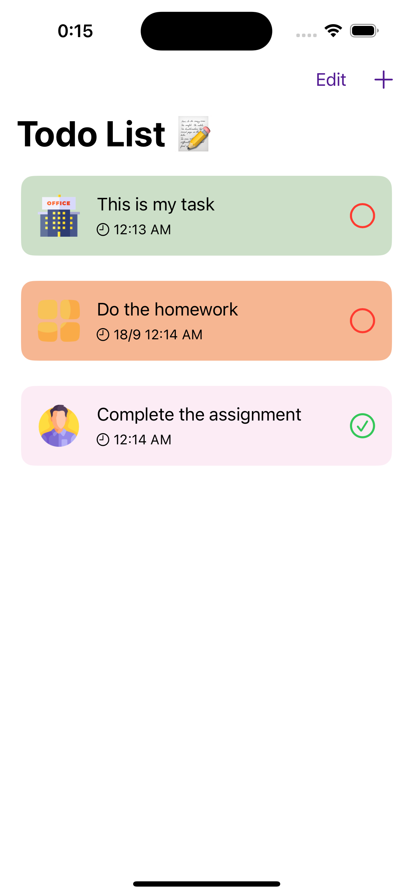

# The Take Home Assessment

Task empty                     |  Task list.               | Add Task
:-----------------------------:|:-------------------------:|:---------------------------:
|  |

Simple iOS Task Management Application. 

## Functions
* Create, read, update, and delete tasks.
* Displaying task list.
* Mark tasks as completed.
* Reminder for tasks with local notification pushing.

## Projects structure, technologies and methodologies
* MVVM (Model - View - View Model) Design Pattern.
* SwiftUI for UI building.
* SwiftData as local storage.

## Faced challenging issues
* At first, I had a hard time choosing the technologies for the project, in my previous projects I often used the Coordnator Pattern combined with MVVM as base structure, UIkit for building the interface, CoreData for storing local data. But after considering, I decided to choose the latest technologies of iOS Development for this project (SwiftUI and SwiftData). The reason is because I want to take the opportunity to do this take home assignment to get familiar with them (I have used SwiftUI for a few small projects and have never used SwiftData before).
* The second problem I encountered while doing the project was the lack of detailed requirements as well as having to design the interface for the screens myself. Honestly, I am not very confident in my design ability but I tried my best to do it.

## Future Improvements:
* Adding Dependency Injection and Units Test for all View Models and Utilities classes
* Adding appropriate documents to classess and methods
* Improve UI for Home and Add/Edit task screens